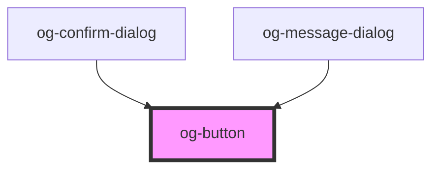

# og-button

<!-- Auto Generated Below -->

## Properties

| Property   | Attribute  | Description                                        | Type      | Default     |
| ---------- | ---------- | -------------------------------------------------- | --------- | ----------- |
| `disabled` | `disabled` | Determines, whether the control is disabled or not | `boolean` | `undefined` |
| `label`    | `label`    | The label of the button                            | `string`  | `undefined` |

## Events

| Event     | Description                                | Type               |
| --------- | ------------------------------------------ | ------------------ |
| `clicked` | Event is being emitted when value changes. | `CustomEvent<any>` |

## CSS Custom Properties

| Name                               | Description                                  | Default Value |
| ---------------------------------- | -------------------------------------------- | ------------- |
| `--og-button-Background`           | Main background color of the button          | --OG-COLOR-SECONDARY--100--20 |
| `--og-button-Background--active`   | Background color when the button is clicked  | --OG-COLOR-SECONDARY--100--10 |
| `--og-button-Background--disabled` | Background color when the button is disabled | --OG-COLOR-SECONDARY--100--07 |
| `--og-button-Background--hover`    | Background color when the button is hovered  | --OG-COLOR-SECONDARY--100--30 |
| `--og-button-BorderRadius`         | Border radius of the button                  | - |
| `--og-button-Color`                | Text color of the button label               | --OG-COLOR-SHADE--100 |
| `--og-button-Color--active`        | Text color when the button is clicked        | --OG-COLOR-SHADE--100 |
| `--og-button-Color--disabled`      | Text color when the button is disabled       | --OG-COLOR-SHADE--100--30 |
| `--og-button-Color--hover`         | Text color when the button is hovered        | --OG-COLOR-SHADE--100 |

## Dependencies

### Used by

 - [og-confirm-dialog](..\og-dialog\og-confirm-dialog)
 - [og-message-dialog](..\og-dialog\og-message-dialog)

### Graph

